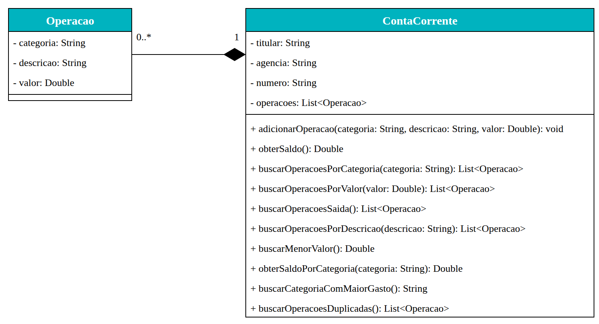

# Exercício Relacionamento 2 📎

## Orientações Gerais: 🚨
1. Utilize **apenas** tipos **wrapper** para criar atributos e métodos.
2. **Respeite** os nomes de atributos e métodos definidos no exercício.
3. Tome **cuidado** com os **argumentos** especificados no exercício.
   **Não** adicione argumentos não solicitados e mantenha a ordem definida no enunciado.
4. Verifique se **não** há **erros de compilação** no projeto antes de enviar.
5. As classes devem seguir as regras de encapsulamento.

## Sistema Bancário

Abra o projeto de exemplo e implemente as classes Operacao e ContaCorrente da
seguinte forma:

## Operação

* Deve possuir todos os métodos getters e setters e um construtor cheio.

## Conta Corrente

* Deve possuir todos os métodos getters e setters, exceto o setter da lista de operações

Métodos:

* adicionarOperacao
  * Deve validar se a categoria ou a descrição estão nulas, ou possuem apenas caracteres em branco. 
  * Deve também validar se o valor da operação é nulo ou igual a 0.
  * Caso a operação seja válida deve adicionar na lista de operações.

* obterSaldo
  * Deve retornar o saldo final da conta após a realização de todas as operações.
  * Caso não tenha nenhuma operação na lista retorne 0.

* buscarOperacoesPorCategoria 
  * Deve buscar todas as operações já realizadas com uma determinada categoria, ignorando letras maiúsculas e minúsculas.
  * Caso não encontre devolva uma lista vazia.

* buscarOperacoesPorValor
  * Deve buscar todas as operações já realizadas com um determinado valor. 
  * Caso não encontre devolva uma lista vazia.

* buscarOperacoesSaida 
  * Deve buscar todas as operações de saída, ou seja, que possuem valor negativo.
  * Caso não encontre devolva uma lista vazia.

* buscarOperacoesPorDescricao
  * Deve buscar todas as operações que contém uma determinada descrição.
  * Para facilitar a busca o método deve permitir que a busca seja realizada com apenas uma parte da descrição para que o usuário não precise digitar a
    descrição completa da operação.
  * Também ignore letras maiúsculas e minúsculas. Caso não encontre devolva uma lista vazia.
  * Caso o parâmetro seja nulo retorne uma lista vazia.
  * **Dica**: Utilize o método contains() para verificar se uma string específica está presente em outra.

    
* buscarMenorValor 
  * Deve buscar o menor valor entre todas as operações realizadas na conta bancária. 
  * Caso não tenha nenhuma operação na lista retorne 0.

* obterSaldoPorCategoria
  * Deve retornar o saldo (entradas menos saídas) das operações de uma determinada categoria, ignorando letras maiúsculas e minúsculas.
  * Caso a categoria seja nula, esteja em branco ou não possua operações retorne 0.

* buscarCategoriaComMaiorGasto
  * Deve retornar o nome da categoria com o maior gasto, ou seja, a maior soma de valores das operações de saída (valores negativos), em módulo.
  * Categorias com grafias diferentes apenas em letras maiúsculas e minúsculas devem ser consideradas a mesma categoria.
  * O nome retornado deve ser escrito exatamente como na primeira operação de saída dessa categoria.
  * As entradas devem ser ignoradas.
  * Em caso de empate, retorne a categoria que aparece primeiro nas operações.
  * Caso não exista nenhuma operação de saída retorne `null`.

* 🏆 **Desafio**: buscarOperacoesDuplicadas
  * Deve retornar as operações que possuem lançamento em duplicidade, ou seja, que possuem a mesma categoria e a mesma descrição (ambas ignorando letras maiúsculas e minúsculas) e o mesmo valor de outra operação da conta.
  * Todas as operações envolvidas em uma duplicidade devem ser retornadas (inclusive a primeira ocorrência), cada uma **apenas uma vez** e na ordem em que foram adicionadas.
  * Uma operação não é duplicada dela mesma.
  * Caso não encontre duplicidades retorne uma lista vazia.

## 💡 Dica 

* Para verificar se uma String possui apenas caracteres em branco, utilize o método `isBlank()` da classe String.